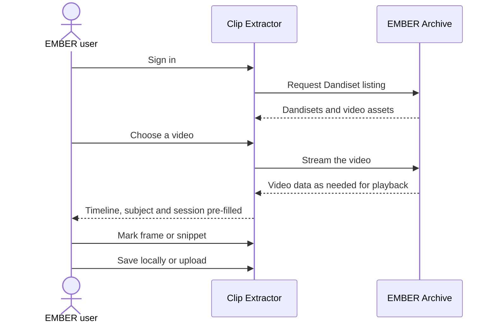
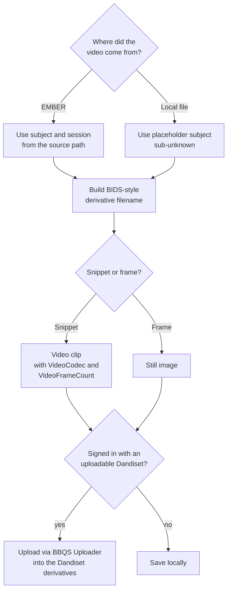
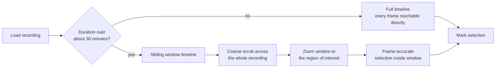
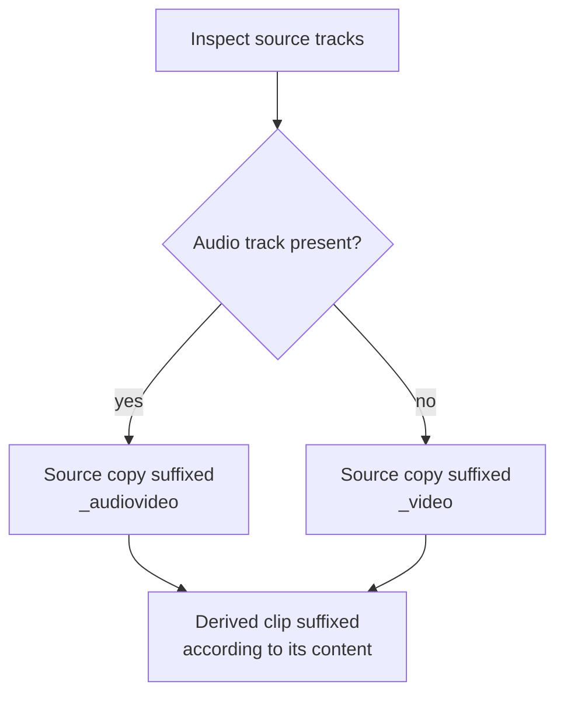

# Archive workflow stories

These stories are about the Clip Extractor as a **front door to EMBER**. The tool is only worth building as a separate application if it makes archive-centred workflows easier than the alternative of downloading, trimming, renaming, and re-uploading by hand.

---

## Story 5: Clip a recording on EMBER without downloading it

**Persona:** Data steward; any signed-in EMBER user.

> As an **EMBER user**, I want to open a video that already lives in a Dandiset, scrub through it, and extract a clip, so that I never have to pull a multi-gigabyte file down to my laptop just to get a few seconds of it.

### Why it matters

The archive is where the data lives. If every derived product requires a round trip through a local disk, the archive becomes a cold backup rather than a working environment. Streaming the video into the browser and extracting from there keeps the archive in the loop.

### Acceptance criteria

- [ ] After signing in, I can browse the videos in a Dandiset from a pane inside the tool.
- [ ] Selecting a video starts playback from the archive without a full download.
- [ ] Subject and session information from the archive path is carried into the tool so the output can be named correctly.
- [ ] The tool records which dataset the clip came from so the output can reference its source.

### Workflow

---

## Story 6: Upload a derivative that lands in the right place with the right name

**Persona:** Data steward for a BBQS lab.

> As a **data steward**, I want the clip I extracted to be uploaded straight into my lab's Dandiset with a BIDS-style name and derivative layout, so that it is discoverable and standard without me hand-editing filenames or running the DANDI CLI for a single file.

### Why it matters

The [data standardization guide](../../user-guide/data-standardization.md) describes the BIDS layout and naming that EMBER expects. Following it by hand for a single derived clip is error-prone and discouraging. If the tool that produced the clip also knows the source subject, session, and dataset, it can do the naming correctly every time.

### Acceptance criteria

- [ ] When the source video came from EMBER, the uploaded clip is named using the source subject and session.
- [ ] When the source video was a local file with no metadata, the tool falls back to a clearly marked placeholder subject rather than guessing.
- [ ] The clip is placed as a derivative, not mixed in with raw source data.
- [ ] The upload goes through the same BBQS Uploader used for other archive uploads, so there is one authentication path and one set of upload rules.
- [ ] I can only upload into Dandisets I actually have access to; if I have none, the tool tells me and still lets me save locally.

### Workflow

---

## Story 7: Work with multi-hour recordings

**Persona:** Behavioral annotator; pose estimation researcher.

> As a **researcher working with overnight or multi-hour recordings**, I want the timeline to stay responsive and precise even when the video is hours long, so that I can find a moment at hour three as easily as a moment at minute three.

### Why it matters

Home-cage and continuous monitoring recordings are the norm in several BBQS projects, not the exception. A timeline designed for a two-minute clip becomes unusable at four hours: the scrubber loses precision and the preview stalls. If the tool cannot handle long recordings, it does not handle BBQS recordings.

### Acceptance criteria

- [ ] For recordings longer than roughly half an hour, the timeline switches to a sliding window so I can zoom into a region and still pick individual frames.
- [ ] Preview frames are sampled rather than fully decoded so scrubbing stays responsive.
- [ ] Marking a range at hour three yields the same frame-accurate result as marking one at minute three.

### Workflow

---

## Story 8: Keep audio with video when it exists

**Persona:** Data steward; researcher working with vocalization or multimodal recordings.

> As a **researcher with audio-and-video recordings**, I want the tool to recognize when a recording has an audio track and name and handle the output accordingly, so that the archive copy correctly reflects what the source actually contains.

### Why it matters

BBQS explicitly covers multimodal behavior, including audio. BEP047 distinguishes between video-only and audio-video recordings. A tool that silently drops the distinction produces archive entries that are wrong in a way nobody notices until much later.

### Acceptance criteria

- [ ] When the source has an audio track, the copy of the source data is labelled as audio-video rather than video-only.
- [ ] Derived clips keep the video suffix appropriate for what they contain.
- [ ] The presence or absence of audio does not change the frame-accuracy of the selection.

### Workflow

---

## Future stories from this theme

| Story | Status | Tracking |
|---|---|---|
| As a data steward, when I clip a video that is already standardized in BEP047 on EMBER, I want device and acquisition metadata that cannot be determined from the video itself to be copied from the source sidecar, so that the derivative is as well-described as its parent. | Planned | [clip-extractor#48](https://github.com/brain-bbqs/clip-extractor/issues/48) |
| As a data steward, when uploading a derivative back into the same Dandiset it came from, I want the tool to write only the derivative and not a duplicate of the source, so that the archive stays free of redundant copies. | Planned | [clip-extractor#48](https://github.com/brain-bbqs/clip-extractor/issues/48) |
