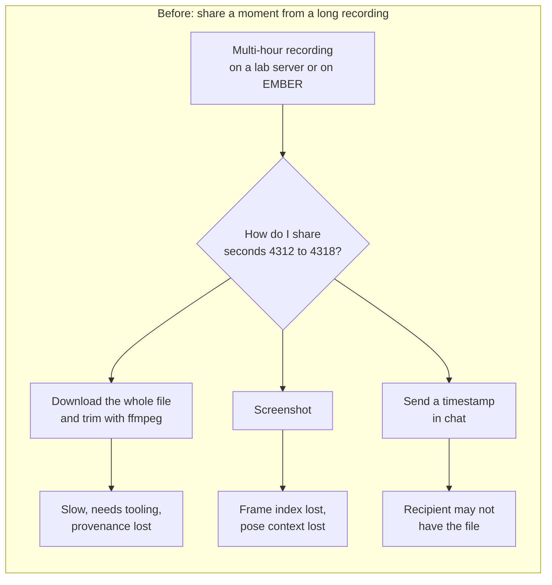
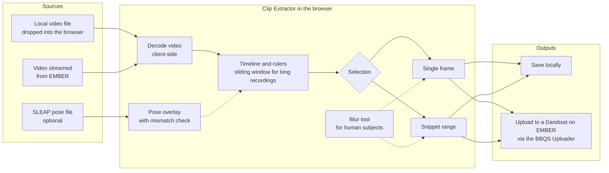
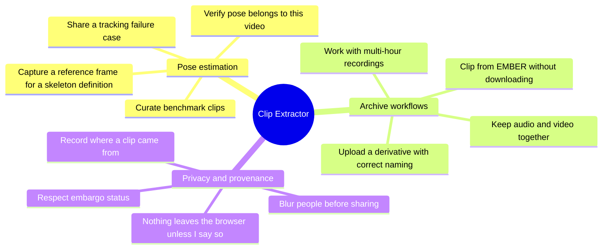

# Why the Clip Extractor exists

The **Clip Extractor** is a web application for selecting a clip from a video, either a snippet (a range of frames) or a single frame, and either saving it locally or uploading it directly to the EMBER Archive.

- Application: <https://clip-extractor.brain-bbqs.org>
- Source code: <https://github.com/brain-bbqs/clip-extractor>
- Built and maintained by the Center for Open Neuroscience. Originally conceived and prototyped by the Talmo Lab as part of [VIBES](https://github.com/talmolab/vibes). Uploads are powered by the [BBQS Uploader](https://github.com/brain-bbqs/bbqs-uploader).

This page explains the problem the tool solves and who it is for. The linked pages contain the individual user stories with acceptance criteria.

!!! note "Origin"
    The need for this tool surfaced in the **Pose Estimation Task Force** discussions at the **2026 BBQS workshop**. The stories here are a written-down version of those discussions and of the follow-on needs that emerged once the tool was connected to the EMBER Archive. They are meant to be revised by the task force as the tool evolves.

## The problem

Behavioral recordings in BBQS are long. A single session can run for hours and a single file can be tens of gigabytes. The interesting moments, however, are short: a few seconds where a tracker loses an animal, a single frame where two subjects overlap, a bout of a rare behavior that a model should learn to recognize.

Before the Clip Extractor, moving one of those moments from a recording to a colleague, a task force, an annotation tool, or the archive meant one of the following:

- downloading the whole recording and trimming it with command-line tools,
- taking a screenshot and losing the frame index and the source,
- sharing a timestamp in a message and hoping the recipient has the same file, or
- not sharing it at all.

Each of these loses either the **precision** (which frame, exactly?), the **provenance** (which recording did this come from?), or the **pose context** (what did the tracker think was happening here?). All of them are slow enough that people skip the step.

## What the tool does

The Clip Extractor runs entirely in the browser. It decodes video client-side, lets the user scrub to a frame or mark a range, optionally overlays pose data from a SLEAP file, and produces either a still image or a trimmed video clip. The output can be saved locally or, when the user is signed in and has an appropriate Dandiset on EMBER, uploaded directly as a derivative with BIDS-style naming.

## Who it is for

| Persona | Short description | Typical need |
|---|---|---|
| **Pose estimation researcher** | Trains or evaluates SLEAP, DeepLabCut, or LightPose models on BBQS recordings. | Share a failure case or a benchmark segment with the exact frame indices and pose overlay intact. |
| **Behavioral annotator** | Labels behavior or keypoints, often as part of the Behavioral Annotation Task Force. | Pull a short, focused clip out of a long recording so annotation tools and annotators are not overwhelmed. |
| **Data steward for a BBQS lab** | Responsible for getting the lab's data onto EMBER in standard form. | Produce derivative clips that land in the right Dandiset with correct BIDS naming and provenance, without a local toolchain. |
| **Task force or working group member** | Reviews examples across labs to define standards such as skeleton definitions. | Grab a representative frame from any accessible recording on EMBER without downloading it. |
| **Compliance-minded PI** | Works with human subjects data or embargoed datasets. | Be confident that nothing leaves the browser unintentionally and that identifiable content can be blurred before sharing. |

## Story map

The stories are grouped by theme. Each page lists the stories, their acceptance criteria, and a diagram of the workflow.

- [Pose estimation stories](pose-estimation.md)
- [Archive workflow stories](archive-workflows.md)
- [Privacy and provenance stories](privacy-and-provenance.md)

## What the tool is not

Keeping scope honest is part of the justification.

- It is **not a video editor**. There is no compositing, no multi-clip timeline, no re-encoding options beyond what is needed to produce a clip.
- It is **not an annotation tool**. It shows existing pose data as an overlay so you can judge it; it does not let you edit keypoints or label behavior. Those needs are covered by the Behavioral Annotation Task Force's platform and by tools such as SLEAP and DeepLabCut.
- It is **not a bulk pipeline**. It is for one moment at a time, chosen by a person. Batch extraction belongs in scripts run against the archive.
