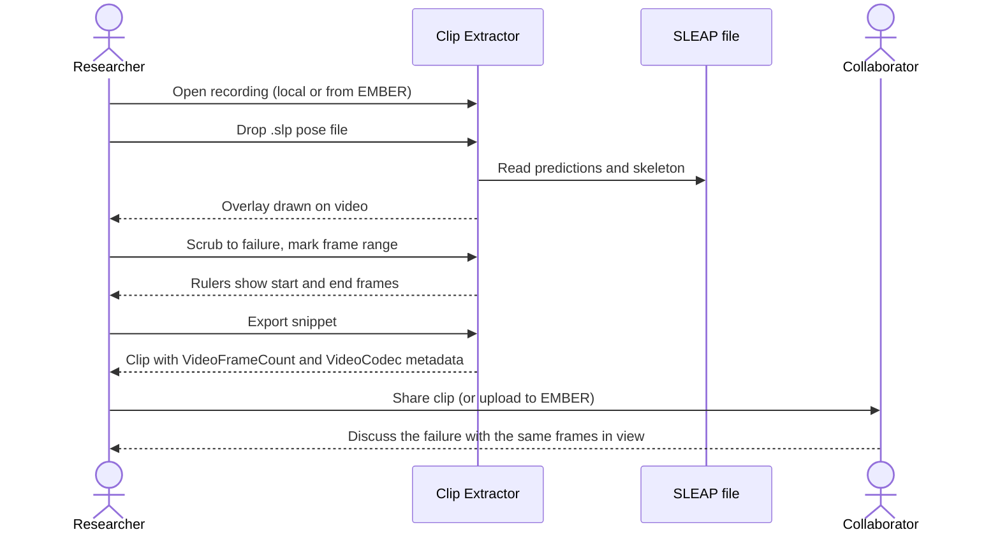
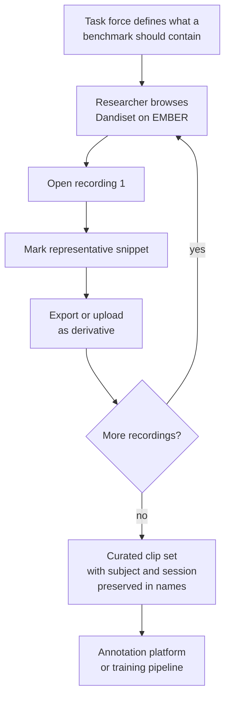
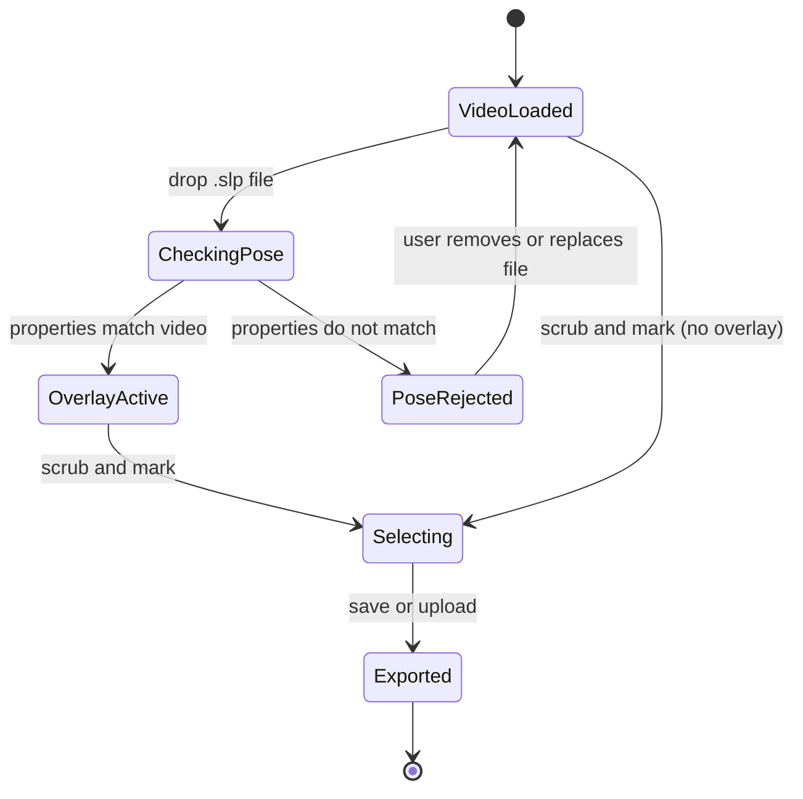
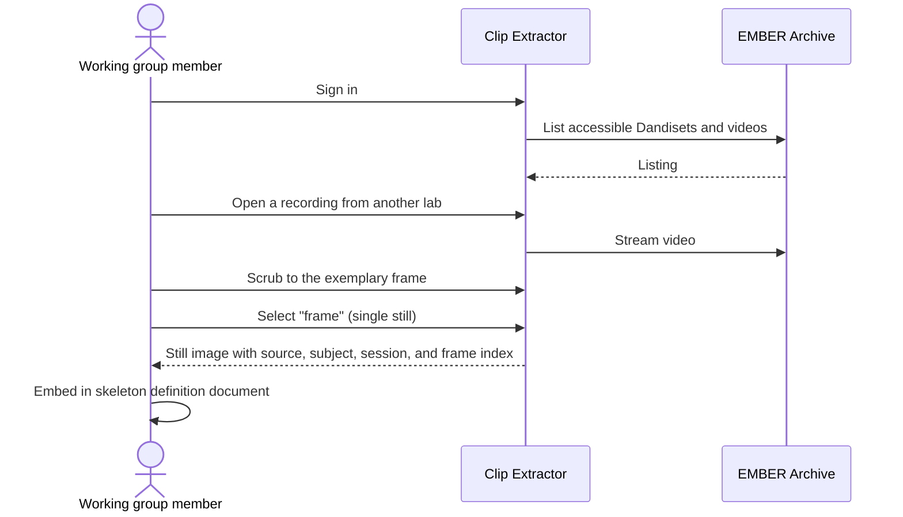

# Pose estimation stories

These stories come most directly from the Pose Estimation Task Force discussions at the 2026 BBQS workshop. The common thread is that pose estimation work is done on **short, specific moments** inside **long recordings**, and that those moments need to travel between people and tools without losing their frame indices or their pose context.

---

## Story 1: Share a tracking failure case

**Persona:** Pose estimation researcher.

> As a **pose estimation researcher**, I want to extract the few seconds where my tracker lost an animal, with the predicted pose drawn on top, so that I can show a collaborator or the task force exactly what went wrong without sending a multi-gigabyte recording.

### Why it matters

Most of the useful conversation in pose estimation is about failures: identity swaps, dropped keypoints, occlusions. Today those conversations happen over screenshots or vague timestamps. A screenshot loses the motion that explains the failure. A timestamp assumes the recipient has the file.

### Acceptance criteria

- [ ] I can open a local video file or a video on EMBER and scrub to the frame where the failure begins.
- [ ] I can mark a snippet range by frame, not just by rough time, and the rulers show me which frames are included.
- [ ] I can load a SLEAP `.slp` file and see the predicted skeleton drawn over the video while I scrub.
- [ ] The exported clip carries the frame count and codec information so the recipient can line it back up against the source.
- [ ] The whole process takes minutes, not an afternoon, and requires no command-line tools.

### Workflow

---

## Story 2: Curate benchmark and training clips

**Persona:** Pose estimation researcher, working with the Behavioral Annotation Task Force.

> As a **pose estimation researcher**, I want to pull short, representative clips out of many long recordings, so that the task force can assemble benchmark sets and annotation batches from moments that matter rather than from whole sessions.

### Why it matters

The Behavioral Annotation Task Force is building a centralized collection of rodent videos for crowdsourced labeling, with milestones measured in millions of labeled frames. Annotators and annotation tools work far better on focused clips than on hour-long files. Someone has to choose those clips, and the person best placed to choose is the researcher who knows where the interesting behavior is.

### Acceptance criteria

- [ ] I can browse videos in a Dandiset on EMBER from inside the tool and open one without downloading it first.
- [ ] I can extract a snippet and have it named consistently with the source subject and session, so a curated set stays traceable.
- [ ] Repeating the process across several recordings does not require re-learning the tool or re-authenticating each time.
- [ ] The exported clips are ordinary video files that annotation platforms and training pipelines can ingest without conversion.

### Workflow

---

## Story 3: Verify that a pose file belongs to this video

**Persona:** Pose estimation researcher; behavioral annotator.

> As a **pose estimation researcher**, I want the tool to tell me when the pose file I loaded does not match the video I am looking at, so that I do not share or archive a clip whose overlay describes a different recording.

### Why it matters

Pose files and videos get separated. Filenames drift, sessions get re-exported, and a `.slp` from one recording is easily dropped onto another. An overlay that is subtly wrong is worse than no overlay, because it looks authoritative.

### Acceptance criteria

- [ ] When I load a pose file whose properties do not match the video (for example, a different frame count or dimensions), the tool refuses the overlay and tells me why.
- [ ] When the pose file does match, the overlay tracks the video frame-accurately as I scrub.
- [ ] The mismatch check happens before I export, so a bad pairing cannot silently end up in a shared clip.

### Workflow

---

## Story 4: Capture a reference frame for a skeleton definition

**Persona:** Task force or working group member.

> As a **member of a standards working group**, I want to grab a single, exact frame from any recording I can access on EMBER, so that skeleton definitions and annotation guidelines can point at real examples instead of drawings.

### Why it matters

The Behavioral Annotation Task Force has called for rigorous, anatomically justified standard skeleton definitions. Writing such a definition means saying "this is what we mean by the left hind paw keypoint on this species in this camera view" and showing it. That requires precise frames from real recordings across labs, which in turn requires being able to open those recordings without downloading them.

### Acceptance criteria

- [ ] I can select a single frame, rather than a range, and export it as a still image.
- [ ] Frame extraction works even in environments where full video re-encoding is not available, because a still does not require it.
- [ ] The still keeps enough context (source dataset, subject, session, frame index) that a reader of the guideline can find the original.
- [ ] I can do this for a recording on EMBER while signed in, without first copying the file to my machine.

### Workflow

---

## Future stories from this theme

These are needs that the task force raised, or that follow naturally from the stories above, and that are tracked as planned work in the Clip Extractor repository.

| Story | Status | Tracking |
|---|---|---|
| As a researcher, I want to see pose overlays for recordings streamed from EMBER, using derivative pose data already stored in the archive, so that I do not need a local copy of the pose file. | Planned | [clip-extractor#46](https://github.com/brain-bbqs/clip-extractor/issues/46) |
