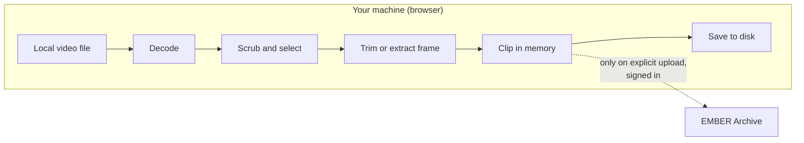
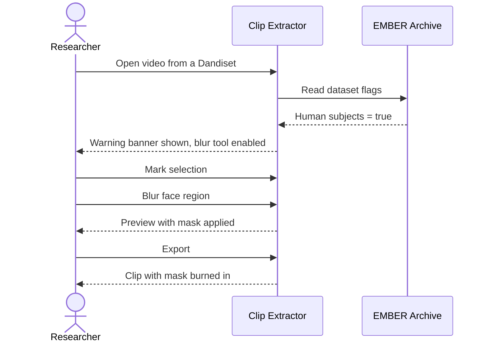
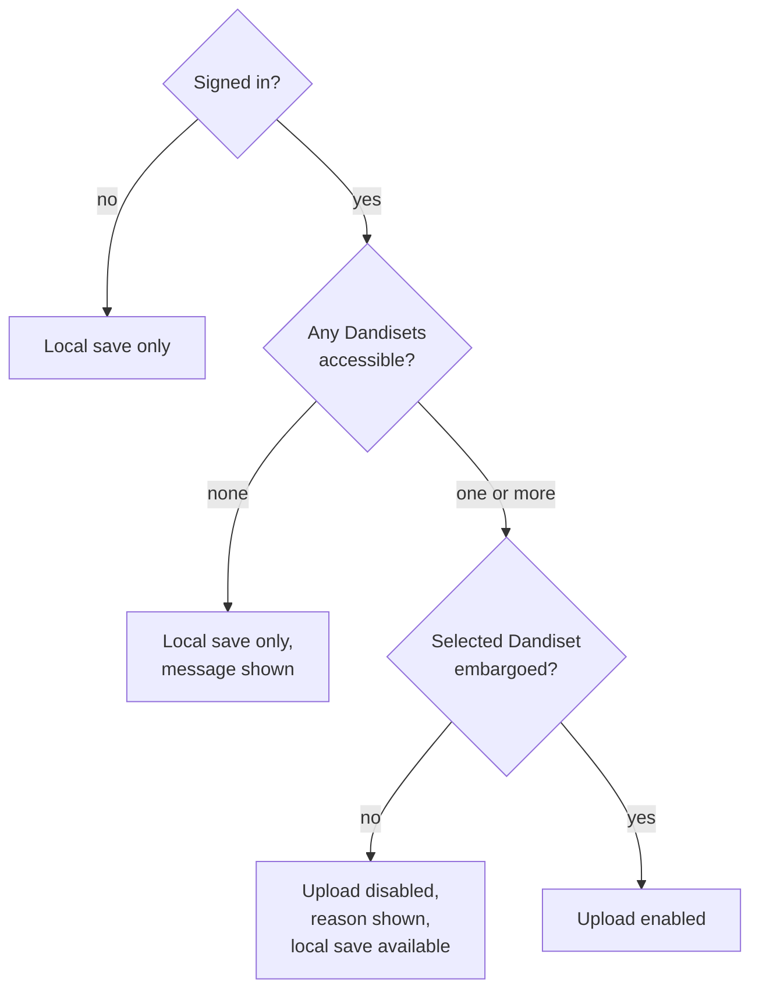
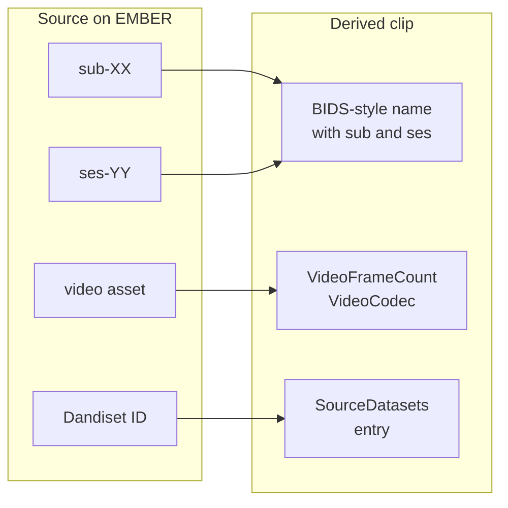

# Privacy and provenance stories

BBQS data includes human subjects recordings and embargoed datasets. A tool that makes sharing clips easy also makes sharing the wrong clip easy. These stories are the guardrails that make the convenience of the Clip Extractor acceptable to a compliance-minded PI and to the archive.

---

## Story 9: Nothing leaves the browser unless I say so

**Persona:** Compliance-minded PI; any user with sensitive recordings.

> As a **PI responsible for sensitive recordings**, I want the tool to decode and trim video entirely on my machine, so that opening a local file in the tool is never itself a disclosure.

### Why it matters

Many "upload a video and we'll process it" services exist. None of them are acceptable for unreleased human subjects data or for embargoed animal data. The Clip Extractor's value depends on the guarantee that a locally opened file stays local until the user explicitly chooses to upload the result.

### Acceptance criteria

- [ ] Opening a local file performs all decoding and trimming in the browser; no video data is sent to a server for processing.
- [ ] The only network transfer of clip content is the explicit upload step, which requires a signed-in user and a deliberate action.
- [ ] Saving locally is always available, even when signed out or when I have no Dandiset to upload to.

### Workflow

---

## Story 10: Blur people before sharing

**Persona:** Researcher working with human subjects video.

> As a **researcher working with human subjects data**, I want the tool to warn me when the dataset is flagged as containing human subjects and to give me a blur tool, so that I can redact faces or identifying features before a clip goes anywhere.

### Why it matters

BBQS includes human intracranial and behavioral studies where video of participants is a core modality. The [data standardization guide](../../user-guide/data-standardization.md) already cautions against sending PHI/PII to online validators. The same care has to apply to clips: a three-second excerpt of a participant's face is still identifiable.

### Acceptance criteria

- [ ] When the dataset is flagged as involving human subjects, the tool shows a visible warning before I can export.
- [ ] A blur tool is available that lets me mask a region of the frame, and the mask is applied to the exported clip or still.
- [ ] The warning and blur tool do not depend on my remembering to turn them on; they appear because of the dataset flag.

### Workflow

---

## Story 11: Respect embargo status

**Persona:** Data steward; compliance-minded PI.

> As a **data steward**, I want the tool to only allow uploads into Dandisets where adding a derivative is appropriate, and to tell me clearly when it is not, so that I cannot accidentally alter a published dataset from a browser tool.

### Why it matters

Once a Dandiset is published and public, changes to it should go through the normal, reviewed publication process rather than through a quick upload from a clip tool. Embargoed (not yet public) Dandisets are where in-progress derivatives belong. The tool enforcing this rule removes a whole class of accidents.

### Acceptance criteria

- [ ] For a Dandiset that is not embargoed, the upload option is disabled and the tool explains why.
- [ ] For an embargoed Dandiset I have access to, upload is available.
- [ ] If I am signed in but have no eligible Dandiset, the tool says so and offers local save instead of failing silently.
- [ ] Signed-out users can still use every local feature of the tool.

### Workflow

---

## Story 12: Record where a clip came from

**Persona:** Data steward; anyone who receives a clip.

> As a **person who receives or finds a clip**, I want the clip to say which recording, subject, session, dataset, and frame range it was taken from, so that I can go back to the original and trust what I am looking at.

### Why it matters

A clip without provenance is an anecdote. A clip with provenance is evidence. The whole point of extracting from the archive rather than from a random local copy is that the archive can be cited. That only works if the derivative points back at its source.

### Acceptance criteria

- [ ] Clips derived from EMBER sources carry a reference to the source dataset.
- [ ] Snippet exports include the frame count and codec, so the range can be re-derived from the source.
- [ ] The output naming preserves subject and session from the source.
- [ ] When the source is a local file with unknown provenance, the output makes that lack of provenance visible rather than inventing values.

### Workflow

---

## Future stories from this theme

| Story | Status | Tracking |
|---|---|---|
| As a data steward, I want the derivative to carry full BEP028 provenance describing the tool, version, parameters, and source, so that the archive can answer "how was this produced?" in a machine-readable way. | Planned | [clip-extractor#42](https://github.com/brain-bbqs/clip-extractor/issues/42) |
