# Clip Extractor: user stories

User stories in support of the **Clip Extractor** usability; a web application for selecting a clip from a video, either a snippet (a range of frames) or a single frame, and either saving it locally or uploading it directly to the EMBER Archive.

- Application: https://clip-extractor.brain-bbqs.org
- Source code: https://github.com/brain-bbqs/clip-extractor

> [!NOTE]
> The need for this tool surfaced in the **Pose Estimation Task Force** discussions at the **2026 BBQS workshop**. The stories here are a written-down version of those discussions and of the follow-on needs that emerged once the tool was connected to the EMBER Archive. They are meant to be revised by the task force as the tool evolves.

Each story is written as *As a [kind of user], I want [a capability], so that [an outcome I care about]*, followed by why it matters, acceptance criteria that someone other than the author could check, and a diagram of the workflow.

**Contents**

1. [The problem](#the-problem)
2. [What the tool does](#what-the-tool-does)
3. [Who it is for](#who-it-is-for)
4. [Story map](#story-map)
5. [Pose estimation stories](#pose-estimation-stories) (stories 1 to 4)
6. [Archive workflow stories](#archive-workflow-stories) (stories 5 to 8)
7. [Privacy and provenance stories](#privacy-and-provenance-stories) (stories 9 to 12)
8. [Future stories](#future-stories)
9. [What the tool is not](#what-the-tool-is-not)

---

## The problem

Behavioral recordings in BBQS are long. A single session can run for hours and a single file can be tens of gigabytes. The interesting moments, however, are short: a few seconds where a tracker loses an animal, a single frame where two subjects overlap, a bout of a rare behavior that a model should learn to recognize.

Before the Clip Extractor, moving one of those moments from a recording to a colleague, another task force, an annotation tool, or the archive meant one of the following:

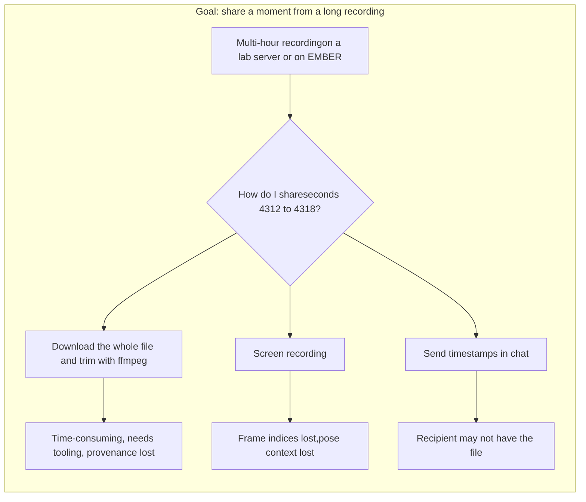

Each of these loses either the **precision** (which frame, exactly?), the **provenance** (which recording did this come from?), or the **pose context** (what did the tracker think was happening here?). All of them are slow enough that people skip the step.

## What the tool does

The Clip Extractor runs entirely in the browser. It decodes video client-side, lets the user scrub to a frame or mark a range, optionally overlays pose data from a SLEAP file, and produces either a still image or a trimmed video clip. The output can be saved locally or, when the user is signed in and has an appropriate Dandiset on EMBER, uploaded directly as a derivative with BIDS-style naming.

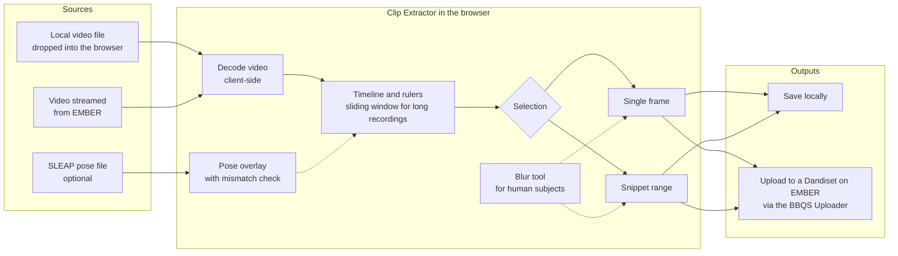

## Who it is for

| Persona | Short description | Typical need |
|---|---|---|
| **Pose estimation researcher** | Trains or evaluates SLEAP, DeepLabCut, or LightPose models on BBQS recordings. | Share a failure case or a benchmark segment with the exact frame indices and pose overlay intact. |
| **Behavioral annotator** | Labels behavior or keypoints, often as part of the Behavioral Annotation Task Force. | Pull a short, focused clip out of a long recording so annotation tools and annotators are not overwhelmed. |
| **Data steward for a BBQS lab** | Responsible for getting the lab's data onto EMBER in standard form. | Produce derivative clips that land in the right Dandiset with correct BIDS naming and provenance, without a local toolchain. |
| **Task force or working group member** | Reviews examples across labs to define standards such as skeleton definitions. | Grab a representative frame from any accessible recording on EMBER without downloading it. |
| **Compliance-minded PI** | Works with human subjects data or embargoed datasets. | Be confident that nothing leaves the browser unintentionally and that identifiable content can be blurred before sharing. |

## Story map

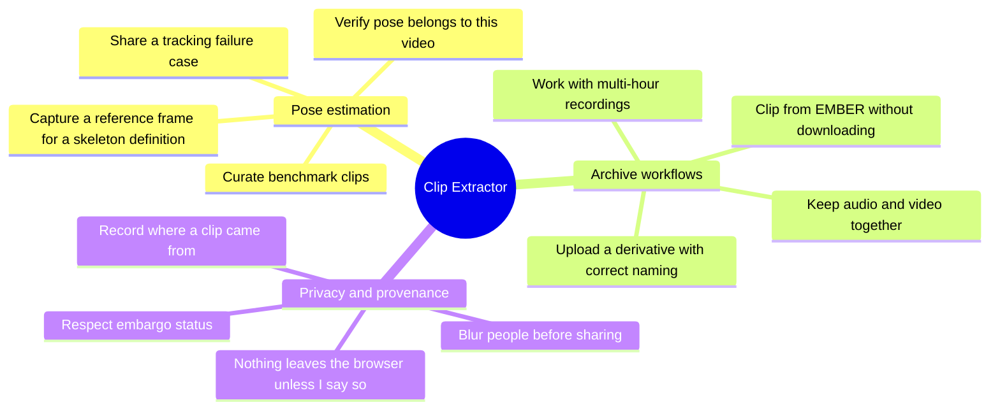

---

## Pose estimation stories

These stories come most directly from the Pose Estimation Task Force discussions. The common thread is that pose estimation work is done on **short, specific moments** inside **long recordings**, and that those moments need to travel between people and tools without losing their frame indices or their pose context.

### Story 1: Share a tracking failure case

**Persona:** Pose estimation researcher.

> As a **pose estimation researcher**, I want to extract the few seconds where my tracker lost an animal, with the predicted pose drawn on top, so that I can show a collaborator or the task force exactly what went wrong without sending a multi-gigabyte recording.

**Why it matters.** Most of the useful conversation in pose estimation is about failures: identity swaps, dropped keypoints, occlusions. Today those conversations happen over screenshots or vague timestamps. A screenshot loses the motion that explains the failure. A timestamp assumes the recipient has the file.

**Acceptance criteria**

- [ ] I can open a local video file or a video on EMBER and scrub to the frame where the failure begins.
- [ ] I can mark a snippet range by frame, not just by rough time, and the rulers show me which frames are included.
- [ ] I can load a SLEAP `.slp` file and see the predicted skeleton drawn over the video while I scrub.
- [ ] The exported clip carries the frame count and codec information so the recipient can line it back up against the source.
- [ ] The whole process takes minutes, not an afternoon, and requires no command-line tools.

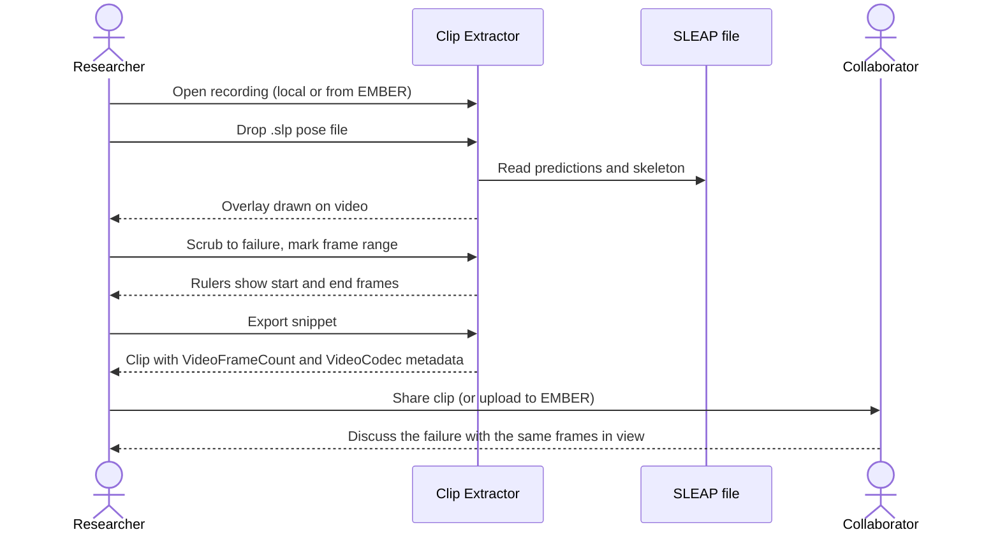

### Story 2: Curate benchmark and training clips

**Persona:** Pose estimation researcher, working with the Behavioral Annotation Task Force.

> As a **pose estimation researcher**, I want to pull short, representative clips out of many long recordings, so that the task force can assemble benchmark sets and annotation batches from moments that matter rather than from whole sessions.

**Why it matters.** The Behavioral Annotation Task Force is building a centralized collection of rodent videos for crowdsourced labeling, with milestones measured in millions of labeled frames. Annotators and annotation tools work far better on focused clips than on hour-long files. Someone has to choose those clips, and the person best placed to choose is the researcher who knows where the interesting behavior is.

**Acceptance criteria**

- [ ] I can browse videos in a Dandiset on EMBER from inside the tool and open one without downloading it first.
- [ ] I can extract a snippet and have it named consistently with the source subject and session, so a curated set stays traceable.
- [ ] Repeating the process across several recordings does not require re-learning the tool or re-authenticating each time.
- [ ] The exported clips are ordinary video files that annotation platforms and training pipelines can ingest without conversion.

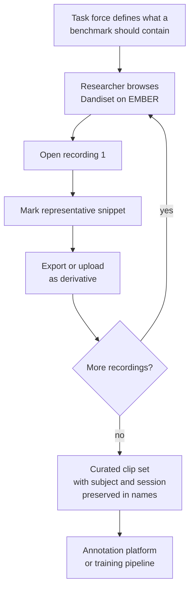

### Story 3: Verify that a pose file belongs to this video

**Persona:** Pose estimation researcher; behavioral annotator.

> As a **pose estimation researcher**, I want the tool to tell me when the pose file I loaded does not match the video I am looking at, so that I do not share or archive a clip whose overlay describes a different recording.

**Why it matters.** Pose files and videos get separated. Filenames drift, sessions get re-exported, and a `.slp` from one recording is easily dropped onto another. An overlay that is subtly wrong is worse than no overlay, because it looks authoritative.

**Acceptance criteria**

- [ ] When I load a pose file whose properties do not match the video (for example, a different frame count or dimensions), the tool refuses the overlay and tells me why.
- [ ] When the pose file does match, the overlay tracks the video frame-accurately as I scrub.
- [ ] The mismatch check happens before I export, so a bad pairing cannot silently end up in a shared clip.

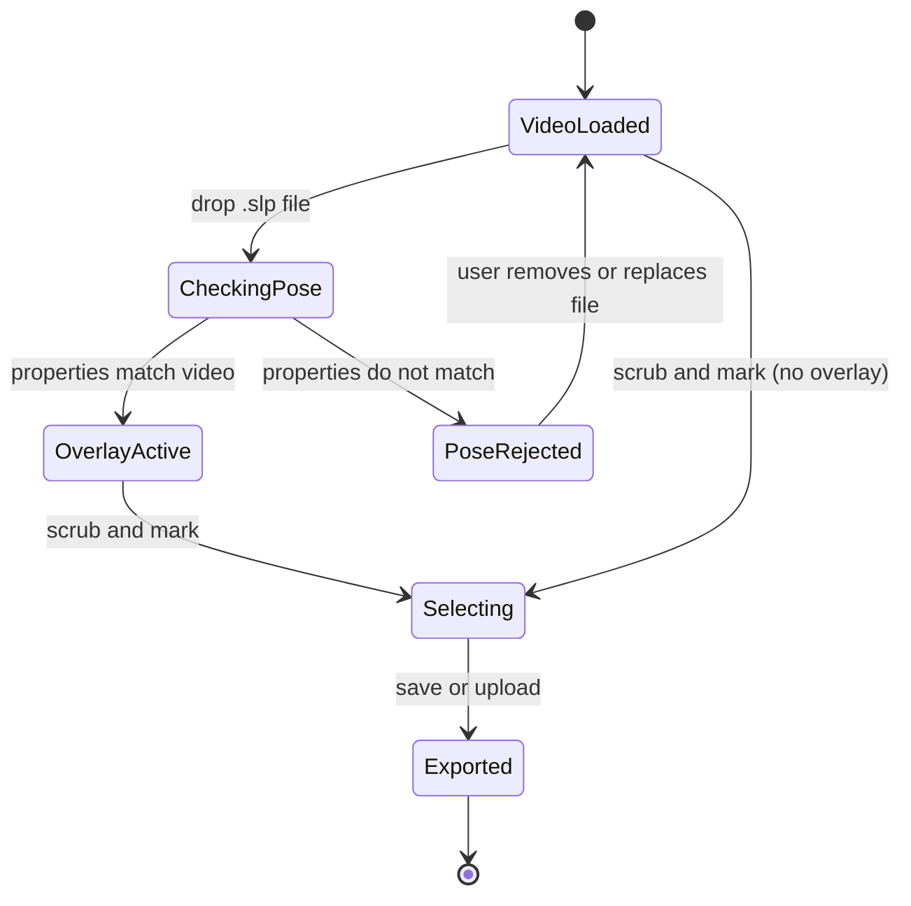

### Story 4: Capture a reference frame for a skeleton definition

**Persona:** Task force or working group member.

> As a **member of a standards working group**, I want to grab a single, exact frame from any recording I can access on EMBER, so that skeleton definitions and annotation guidelines can point at real examples instead of drawings.

**Why it matters.** The Behavioral Annotation Task Force has called for rigorous, anatomically justified standard skeleton definitions. Writing such a definition means saying "this is what we mean by the left hind paw keypoint on this species in this camera view" and showing it. That requires precise frames from real recordings across labs, which in turn requires being able to open those recordings without downloading them.

**Acceptance criteria**

- [ ] I can select a single frame, rather than a range, and export it as a still image.
- [ ] Frame extraction works even in environments where full video re-encoding is not available, because a still does not require it.
- [ ] The still keeps enough context (source dataset, subject, session, frame index) that a reader of the guideline can find the original.
- [ ] I can do this for a recording on EMBER while signed in, without first copying the file to my machine.

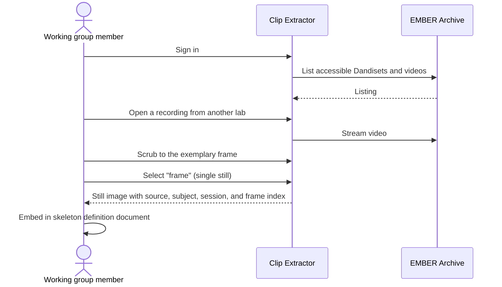

---

## Archive workflow stories

These stories are about the Clip Extractor as a **front door to EMBER**. The tool is only worth building as a separate application if it makes archive-centred workflows easier than the alternative of downloading, trimming, renaming, and re-uploading by hand.

### Story 5: Clip a recording on EMBER without downloading it

**Persona:** Data steward; any signed-in EMBER user.

> As an **EMBER user**, I want to open a video that already lives in a Dandiset, scrub through it, and extract a clip, so that I never have to pull a multi-gigabyte file down to my laptop just to get a few seconds of it.

**Why it matters.** The archive is where the data lives. If every derived product requires a round trip through a local disk, the archive becomes a cold backup rather than a working environment. Streaming the video into the browser and extracting from there keeps the archive in the loop.

**Acceptance criteria**

- [ ] After signing in, I can browse the videos in a Dandiset from a pane inside the tool.
- [ ] Selecting a video starts playback from the archive without a full download.
- [ ] Subject and session information from the archive path is carried into the tool so the output can be named correctly.
- [ ] The tool records which dataset the clip came from so the output can reference its source.

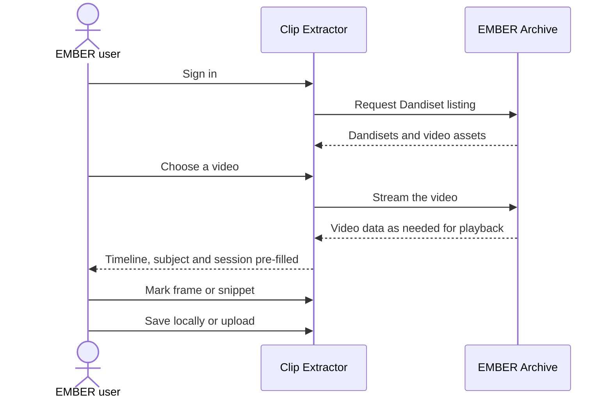

### Story 6: Upload a derivative that lands in the right place with the right name

**Persona:** Data steward for a BBQS lab.

> As a **data steward**, I want the clip I extracted to be uploaded straight into my lab's Dandiset with a BIDS-style name and derivative layout, so that it is discoverable and standard without me hand-editing filenames or running the DANDI CLI for a single file.

**Why it matters.** The [data standardization guide](../docs/user-guide/data-standardization.md) describes the BIDS layout and naming that EMBER expects. Following it by hand for a single derived clip is error-prone and discouraging. If the tool that produced the clip also knows the source subject, session, and dataset, it can do the naming correctly every time.

**Acceptance criteria**

- [ ] When the source video came from EMBER, the uploaded clip is named using the source subject and session.
- [ ] When the source video was a local file with no metadata, the tool falls back to a clearly marked placeholder subject rather than guessing.
- [ ] The clip is placed as a derivative, not mixed in with raw source data.
- [ ] The upload goes through the same BBQS Uploader used for other archive uploads, so there is one authentication path and one set of upload rules.
- [ ] I can only upload into Dandisets I actually have access to; if I have none, the tool tells me and still lets me save locally.

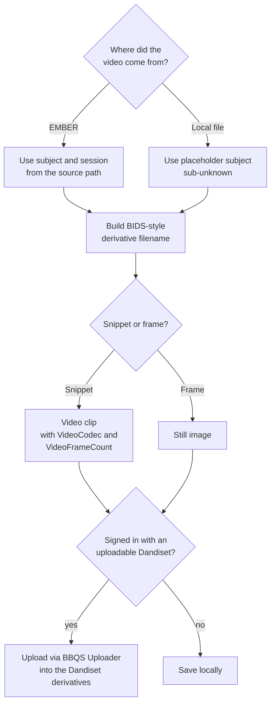

### Story 7: Work with multi-hour recordings

**Persona:** Behavioral annotator; pose estimation researcher.

> As a **researcher working with overnight or multi-hour recordings**, I want the timeline to stay responsive and precise even when the video is hours long, so that I can find a moment at hour three as easily as a moment at minute three.

**Why it matters.** Home-cage and continuous monitoring recordings are the norm in several BBQS projects, not the exception. A timeline designed for a two-minute clip becomes unusable at four hours: the scrubber loses precision and the preview stalls. If the tool cannot handle long recordings, it does not handle BBQS recordings.

**Acceptance criteria**

- [ ] For recordings longer than roughly half an hour, the timeline switches to a sliding window so I can zoom into a region and still pick individual frames.
- [ ] Preview frames are sampled rather than fully decoded so scrubbing stays responsive.
- [ ] Marking a range at hour three yields the same frame-accurate result as marking one at minute three.

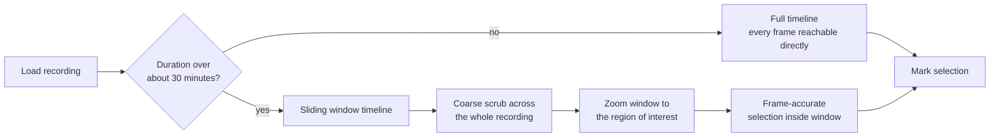

### Story 8: Keep audio with video when it exists

**Persona:** Data steward; researcher working with vocalization or multimodal recordings.

> As a **researcher with audio-and-video recordings**, I want the tool to recognize when a recording has an audio track and name and handle the output accordingly, so that the archive copy correctly reflects what the source actually contains.

**Why it matters.** BBQS explicitly covers multimodal behavior, including audio. BEP047 distinguishes between video-only and audio-video recordings. A tool that silently drops the distinction produces archive entries that are wrong in a way nobody notices until much later.

**Acceptance criteria**

- [ ] When the source has an audio track, the copy of the source data is labelled as audio-video rather than video-only.
- [ ] Derived clips keep the video suffix appropriate for what they contain.
- [ ] The presence or absence of audio does not change the frame-accuracy of the selection.

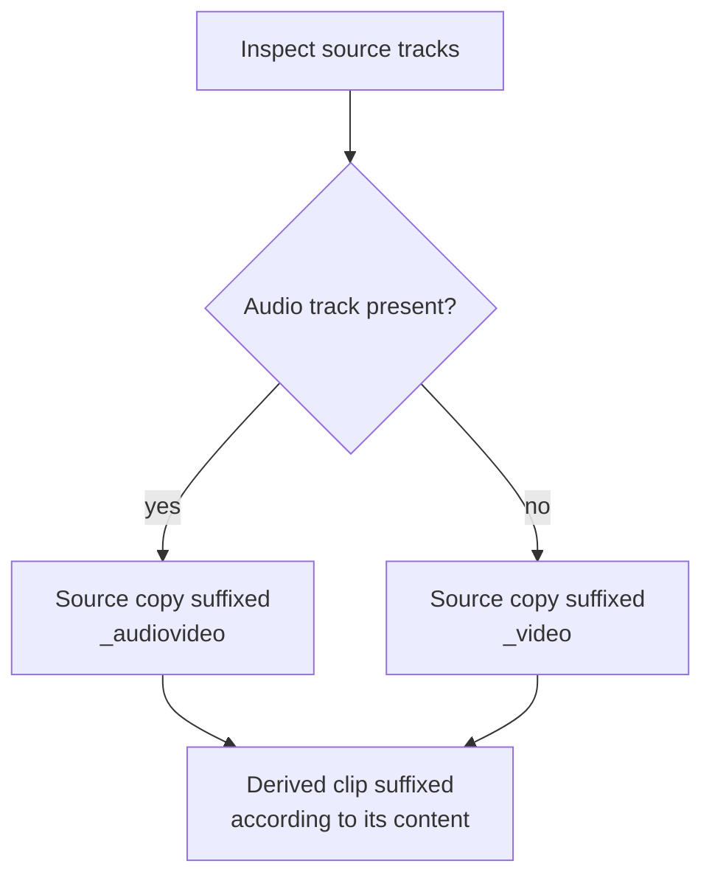

---

## Privacy and provenance stories

BBQS data includes human subjects recordings and embargoed datasets. A tool that makes sharing clips easy also makes sharing the wrong clip easy. These stories are the guardrails that make the convenience of the Clip Extractor acceptable to a compliance-minded PI and to the archive.

### Story 9: Nothing leaves the browser unless I say so

**Persona:** Compliance-minded PI; any user with sensitive recordings.

> As a **PI responsible for sensitive recordings**, I want the tool to decode and trim video entirely on my machine, so that opening a local file in the tool is never itself a disclosure.

**Why it matters.** Many "upload a video and we'll process it" services exist. None of them are acceptable for unreleased human subjects data or for embargoed animal data. The Clip Extractor's value depends on the guarantee that a locally opened file stays local until the user explicitly chooses to upload the result.

**Acceptance criteria**

- [ ] Opening a local file performs all decoding and trimming in the browser; no video data is sent to a server for processing.
- [ ] The only network transfer of clip content is the explicit upload step, which requires a signed-in user and a deliberate action.
- [ ] Saving locally is always available, even when signed out or when I have no Dandiset to upload to.

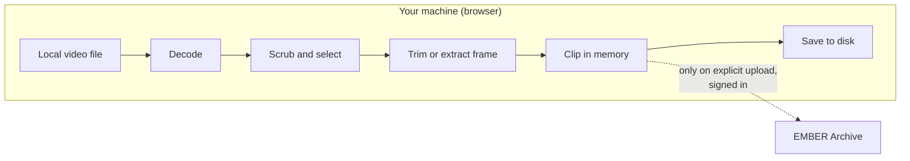

### Story 10: Blur people before sharing

**Persona:** Researcher working with human subjects video.

> As a **researcher working with human subjects data**, I want the tool to warn me when the dataset is flagged as containing human subjects and to give me a blur tool, so that I can redact faces or identifying features before a clip goes anywhere.

**Why it matters.** BBQS includes human intracranial and behavioral studies where video of participants is a core modality. The [data standardization guide](../docs/user-guide/data-standardization.md) already cautions against sending PHI/PII to online validators. The same care has to apply to clips: a three-second excerpt of a participant's face is still identifiable.

**Acceptance criteria**

- [ ] When the dataset is flagged as involving human subjects, the tool shows a visible warning before I can export.
- [ ] A blur tool is available that lets me mask a region of the frame, and the mask is applied to the exported clip or still.
- [ ] The warning and blur tool do not depend on my remembering to turn them on; they appear because of the dataset flag.

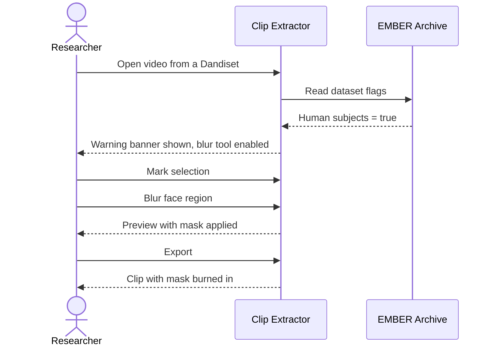

### Story 11: Respect embargo status

**Persona:** Data steward; compliance-minded PI.

> As a **data steward**, I want the tool to only allow uploads into Dandisets where adding a derivative is appropriate, and to tell me clearly when it is not, so that I cannot accidentally alter a published dataset from a browser tool.

**Why it matters.** Once a Dandiset is published and public, changes to it should go through the normal, reviewed publication process rather than through a quick upload from a clip tool. Embargoed (not yet public) Dandisets are where in-progress derivatives belong. The tool enforcing this rule removes a whole class of accidents.

**Acceptance criteria**

- [ ] For a Dandiset that is not embargoed, the upload option is disabled and the tool explains why.
- [ ] For an embargoed Dandiset I have access to, upload is available.
- [ ] If I am signed in but have no eligible Dandiset, the tool says so and offers local save instead of failing silently.
- [ ] Signed-out users can still use every local feature of the tool.

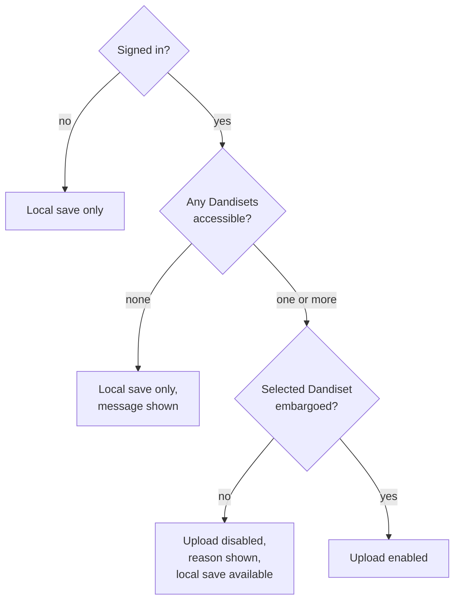

### Story 12: Record where a clip came from

**Persona:** Data steward; anyone who receives a clip.

> As a **person who receives or finds a clip**, I want the clip to say which recording, subject, session, dataset, and frame range it was taken from, so that I can go back to the original and trust what I am looking at.

**Why it matters.** A clip without provenance is an anecdote. A clip with provenance is evidence. The whole point of extracting from the archive rather than from a random local copy is that the archive can be cited. That only works if the derivative points back at its source.

**Acceptance criteria**

- [ ] Clips derived from EMBER sources carry a reference to the source dataset.
- [ ] Snippet exports include the frame count and codec, so the range can be re-derived from the source.
- [ ] The output naming preserves subject and session from the source.
- [ ] When the source is a local file with unknown provenance, the output makes that lack of provenance visible rather than inventing values.

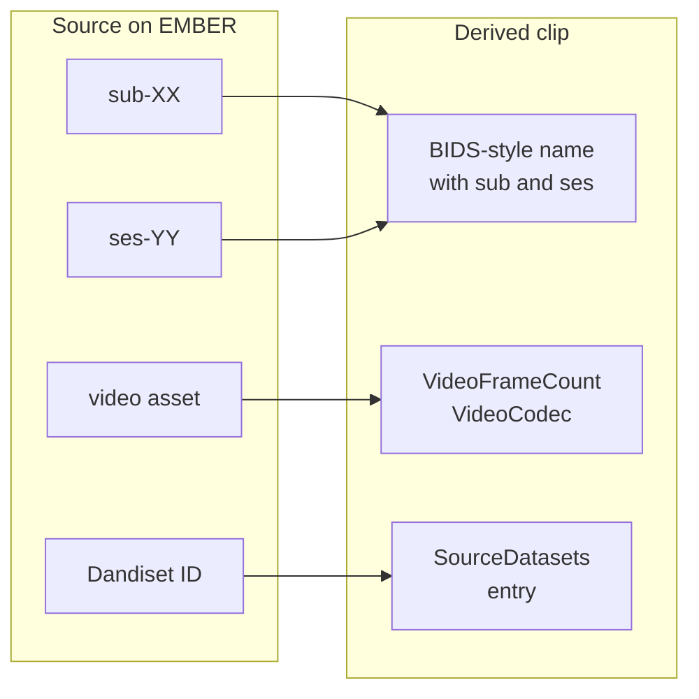

---

## Future stories

Needs that the task force raised, or that follow naturally from the stories above, and that are tracked as planned work in the Clip Extractor repository.

| Story | Theme | Status | Tracking |
|---|---|---|---|
| As a researcher, I want to see pose overlays for recordings streamed from EMBER, using derivative pose data already stored in the archive, so that I do not need a local copy of the pose file. | Pose estimation | Planned | [clip-extractor#46](https://github.com/brain-bbqs/clip-extractor/issues/46) |
| As a data steward, when I clip a video that is already standardized in BEP047 on EMBER, I want device and acquisition metadata that cannot be determined from the video itself to be copied from the source sidecar, so that the derivative is as well-described as its parent. | Archive workflows | Planned | [clip-extractor#48](https://github.com/brain-bbqs/clip-extractor/issues/48) |
| As a data steward, when uploading a derivative back into the same Dandiset it came from, I want the tool to write only the derivative and not a duplicate of the source, so that the archive stays free of redundant copies. | Archive workflows | Planned | [clip-extractor#48](https://github.com/brain-bbqs/clip-extractor/issues/48) |
| As a data steward, I want the derivative to carry full BEP028 provenance describing the tool, version, parameters, and source, so that the archive can answer "how was this produced?" in a machine-readable way. | Privacy and provenance | Planned | [clip-extractor#42](https://github.com/brain-bbqs/clip-extractor/issues/42) |

## What the tool is not

Keeping scope honest is part of the justification.

- It is **not a video editor**. There is no compositing, no multi-clip timeline, no re-encoding options beyond what is needed to produce a clip.
- It is **not an annotation tool**. It shows existing pose data as an overlay so you can judge it; it does not let you edit keypoints or label behavior. Those needs are covered by the Behavioral Annotation Task Force's platform and by tools such as SLEAP and DeepLabCut.
- It is **not a bulk pipeline**. It is for one moment at a time, chosen by a person. Batch extraction belongs in scripts run against the archive.

---

## Contributing a story

Stories are living documents. If your team has a need that is not captured here, or a story does not match how you actually work, open a pull request against this file. When adding a story, include the persona in one line, the story in the "As a / I want / so that" form, two to five acceptance criteria that could be checked by someone other than you, and optionally a Mermaid diagram of the workflow.
