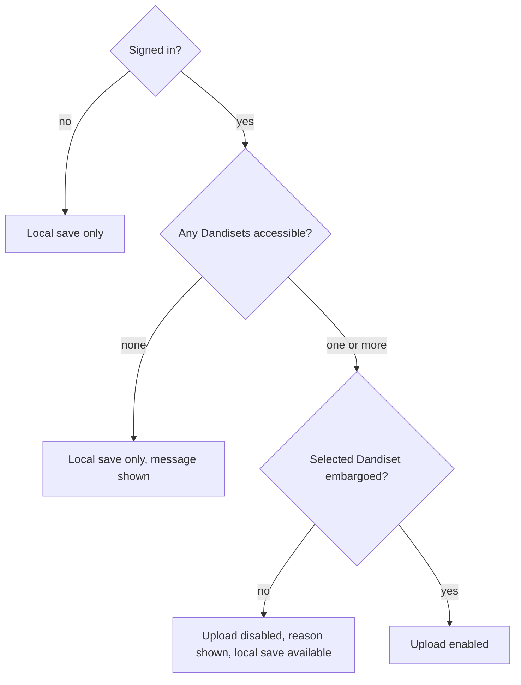

# Story 11: Respect embargo status

**Persona:** Data contributor; compliance-minded PI.

> As a **data contributor**, I want the tool to offer upload only for Dandisets that are still embargoed, and to say plainly when a destination is not eligible, so that I cannot add to a public dataset from a browser tool by accident.

**Why it matters.** Embargo status is about whether a Dandiset is still private to its contributors or has been released publicly. Adding to one that is already public is a different and heavier act than adding to one still in preparation, and it is not something to do by accident from a browser tool. Reading the status and gating on it removes that whole class of accident, and telling the user why the button is unavailable keeps the refusal from looking like a bug.

**Acceptance criteria**

- For a Dandiset that is not embargoed, the upload option is disabled and the tool explains why.
- For an embargoed Dandiset I have access to, upload is available.
- If I am signed in but have no eligible Dandiset, the tool says so and offers local save instead of failing silently.
- Signed-out users can still use every local feature of the tool.

---

[All Clip Extractor stories](README.md) · Previous: [Story 10](story-10-blur-people-before-sharing.md) · Next: [Story 12](story-12-record-where-a-clip-came-from.md)
